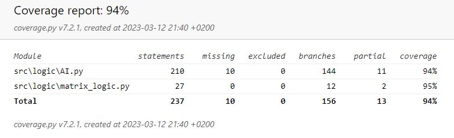

# Test document

## Testing basic functionality of the Logic class

Methods testDropPieceEmpty() and testDropPieceFull() test that the dropPiece() method works as intended and that the game can be played.

## Testing the AI class

Methods testEvaluation() and testGameOver() test that the AI can evaluate positions correctly and that it knows when the game is over and who has won.

## Testing performance

The methods testDepth1(), testDepth3() and testDepth5(), test the performance of the minimax-algorithm with different depths.
 
These tests show that the game is playable on moderns processors and that the algorithm is working as intended.

| Depth | Time |
| :----:|:-----|
| 1 | 0.014s |
| 2 | 0.041s |
| 3 | 0.30s |
| 4 | 1.40s |
| 5 | 5.60s |
| 6 | 18.64s |

## The test coverage-report

